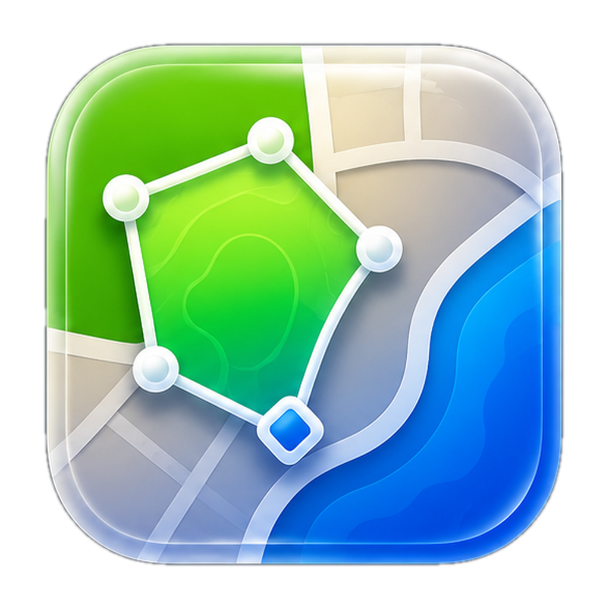
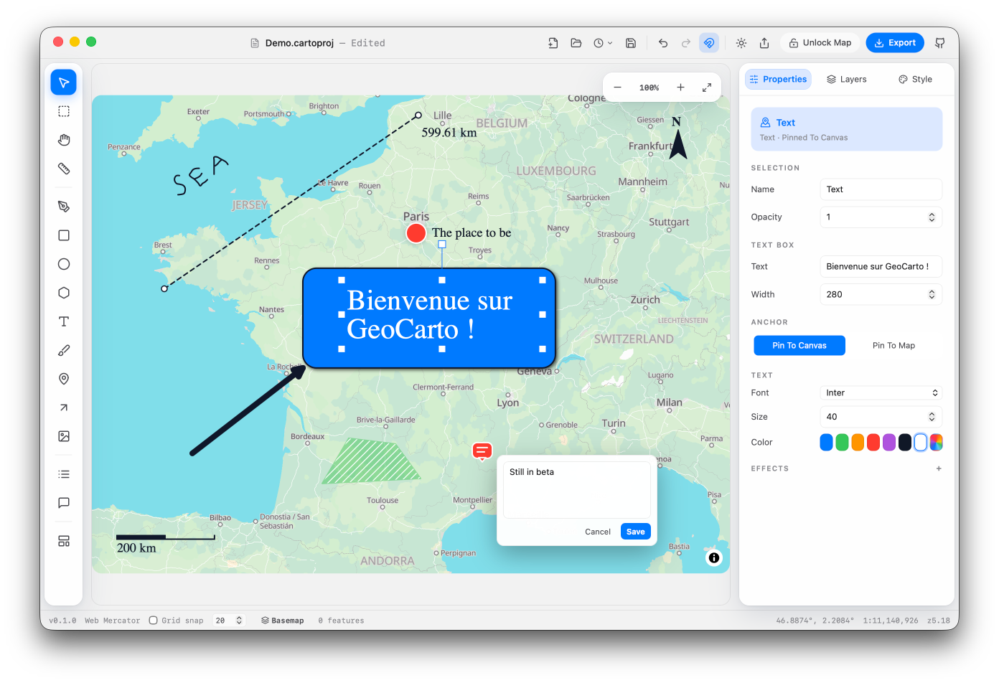

<p align="center">
  
</p>

<h1 align="center">GeoCarto</h1>

<p align="center">
  A visual map editor for editorial and casual map makers.<br/>
  Open a basemap, import your data, annotate freely, export a print-ready image.
</p>

---



---

## What GeoCarto is

GeoCarto is a canvas-based map editor built for people who need good-looking maps without the complexity of a GIS. You get an interactive basemap, a set of drawing and annotation tools, and a direct path to a high-resolution export — all in a single window, in the browser or as a native macOS app.

The target users are journalists, teachers, designers, and anyone who today falls back to Illustrator or a constrained online tool to make a map that looks the way they want.

---

## What you can do today

### Basemap and data
- Open an interactive basemap (OSM-derived PMTiles via Protomaps) — no tile server or API key required
- Switch between four built-in styles: Editorial Light, Editorial Dark, Minimal Grey, Print B&W
- Provide a custom MapLibre style URL as the basemap source
- Toggle individual basemap sub-layers: roads, labels, water, landuse, buildings, boundaries
- Import **GeoJSON, TopoJSON, KML, GPX, and Shapefile** — drag-drop or file picker
- Inspect feature attributes; reorder, show/hide, lock, rename, and delete layers
- Place GeoJSON layers as standard vector or switch them to a **GPU-accelerated heatmap** (deck.gl)

### Annotations
- **Text** — labels with font choice, size, color, and halo
- **Rectangle and ellipse** — filled or stroked shapes
- **Line / arrow** — segments with dashed stroke and arrowheads
- **Polygon** — closed shape with hatch and pattern fill options
- **Point pin** — colored map pin anchored to a geographic location
- **Image** — place a PNG, JPEG, or SVG raster anywhere on the canvas
- **Ruler / measurement** — measure distances and areas on the map

All annotation types support fill, stroke, opacity, drop shadow, blend modes (normal / multiply / screen / overlay), and geo vs. canvas anchoring ("Pin to map" / "Pin to canvas").

### Map furniture
- **Title block and source credit**
- **Scale bar** — snaps to round distances and tracks map scale
- **North arrow** — follows map bearing
- **Legend builder** — manually editable swatches linked to layer styles

### Canvas tools
- Marquee multi-select with shift/cmd/alt modifiers
- Group and ungroup objects (⌘G / ⌘⇧G)
- Smart guides — edge and center alignment cues during drag
- Grid snap — toggleable with configurable spacing
- Undo/redo with 100+ meaningful document steps (⌘Z / ⌘⇧Z)

### Project workflow
- Multi-project tab bar — open several maps at once, each with its own autosave session
- Save and reopen `.cartoproj` project files (plain JSON); recent projects menu
- Browser autosave every 10 seconds (IndexedDB), with per-tab draft recovery on reload
- Dirty-document guards on New, Open, Close, and restore

### Export
- **PNG and JPEG** — 1×, 2×, or custom scale; white or transparent background; JPEG quality slider
- **SVG** — annotations and map furniture export as editable vector objects; basemap and imported data layers are embedded as a raster image
- **PDF** — raster-in-PDF sized to the composition frame

### Desktop
- Native macOS window via Tauri 2, with full feature parity with the web build

---

## Known gaps

GeoCarto is young and moving fast. A few things to expect at this stage:

- Web Mercator is the only projection for now — editorial projections (Robinson, Equal Earth…) are on the roadmap.
- Imported data layers export as raster inside SVG and PDF; annotations and map furniture stay fully editable vectors.
- The macOS desktop app is not yet signed or notarized, so Gatekeeper will warn on first launch.
- GIS analysis (joins, choropleth, buffers) and offline basemap packs are planned, not shipped.

---

## Roadmap

GeoCarto is built in phases. The browser core loop and the editorial toolset are in place — here's what's next.

**Next — editable data & reach**
- Edit imported GeoJSON: move/add/delete vertices, draw new features, edit attributes
- French + English localization, auto-detected with a manual override
- A unified settings surface (appearance, units, canvas defaults, autosave)
- In-app help and discoverability polish
- Local PMTiles files and offline regional basemap packs on desktop

**Later — cartographic depth & print**
- Non-Mercator editorial projections (Robinson, Equal Earth, Winkel Tripel…)
- GIS analysis: attribute joins, choropleth wizard, proportional symbols, buffering
- Print-grade vector PDF and a templates gallery

**Future — collaboration & platform**
- Cloud project sync, share links, and real-time collaboration
- Interactive HTML export
- Windows and Linux desktop builds; a signed & notarized macOS release
- Plugin / extension API

---

## Tech stack

| Concern | Choice |
|---|---|
| Framework | React 19 + TypeScript + Vite 7 |
| Desktop | Tauri 2 (macOS) |
| Basemap | MapLibre GL JS v5 + PMTiles |
| Data layers | deck.gl |
| Annotation canvas | Konva.js |
| Drawing | terra-draw |
| State | Zustand + Immer |
| UI | shadcn/ui (new-york) + Tailwind v4 + Lucide |
| Testing | Vitest + Playwright |

---

## Getting started

### Prerequisites

- Node.js 20+
- Rust + Cargo (desktop build only)

### Web app

```bash
git clone https://github.com/kilianvivien/geocarto.git
cd geocarto
npm install
npm run dev          # http://localhost:5173
```

### macOS desktop app

```bash
npm run tauri dev    # development build with hot-reload
npm run tauri build  # production .app bundle
```

> **First launch:** the desktop app isn't signed or notarized yet, so macOS
> Gatekeeper will block it the first time. To open it anyway, **right-click (or
> Control-click) the app → Open**, then confirm **Open** in the dialog. macOS
> remembers the choice, so afterwards you can launch it normally.
>
> If you only see a greyed-out **Move to Trash** option, go to **System Settings →
> Privacy & Security**, scroll to the security section, and click **Open Anyway**
> next to the GeoCarto warning. On recent macOS versions you may need to do this
> once per build.

---

## Commands

| Command | Description |
|---|---|
| `npm run dev` | Dev server at `http://localhost:5173` |
| `npm run build` | Typecheck + production build |
| `npm run typecheck` | `tsc --noEmit` |
| `npm run lint` | ESLint |
| `npm run format` | Prettier |
| `npm test` | Vitest unit tests |
| `npm run test:e2e` | Playwright end-to-end tests |

---

## Project structure

```
src/
  app/        App shell and platform bridge
  canvas/     Map view, annotation stage, data overlay, export frame
  tools/      Drawing and annotation tools
  layers/     Layer model — ordering, visibility, locking
  style/      Basemap style presets and editor
  import/     Data format parsers (GeoJSON, TopoJSON, KML, GPX, Shapefile)
  export/     Raster, SVG, and PDF exporters
  project/    .cartoproj schema, load/save, autosave
  state/      Application state stores
  ui/         Components, panels, inspector
  basemap/    Basemap integration and style presets
src-tauri/    Tauri 2 desktop shell
```

---

## Contributing

The project is in early development. Issues and pull requests are welcome — please open an issue first for significant changes so we can align on scope before you invest time in an implementation.

---

## Acknowledgements

GeoCarto is built on the shoulders of these open-source projects:

### Core rendering

| Library | License | Notes |
|---|---|---|
| [MapLibre GL JS](https://github.com/maplibre/maplibre-gl-js) | BSD-3-Clause | WebGL vector tile renderer — the map viewport |
| [Protomaps PMTiles](https://github.com/protomaps/PMTiles) | BSD-3-Clause | Single-file tile archive format, no tile server required |
| [@protomaps/basemaps](https://github.com/protomaps/basemaps) | BSD-3-Clause | OSM-derived basemap styles, by The Protomaps Authors |
| [deck.gl](https://github.com/visgl/deck.gl) | MIT | GPU-accelerated data layers (heatmaps), by vis.gl |
| [Konva](https://github.com/konvajs/konva) / [react-konva](https://github.com/konvajs/react-konva) | MIT | 2D canvas stage for annotations, by Anton Lavrenov |

### Data and import

| Library | License | Notes |
|---|---|---|
| [@tmcw/togeojson](https://github.com/placemark/togeojson) | BSD-2-Clause | KML and GPX → GeoJSON parser |
| [shpjs](https://github.com/calvinmetcalf/shapefile-js) | MIT | Shapefile → GeoJSON parser, by Calvin Metcalf |
| [topojson-client](https://github.com/topojson/topojson-client) | ISC | TopoJSON → GeoJSON, by Mike Bostock |

### Export

| Library | License | Notes |
|---|---|---|
| [jsPDF](https://github.com/parallax/jsPDF) | MIT | Raster-in-PDF export |

### State and persistence

| Library | License | Notes |
|---|---|---|
| [Zustand](https://github.com/pmndrs/zustand) | MIT | State management, by Paul Henschel / pmnd.rs |
| [Immer](https://github.com/immerjs/immer) | MIT | Immutable state updates, by Michel Weststrate |
| [idb-keyval](https://github.com/jakearchibald/idb-keyval) | Apache-2.0 | IndexedDB autosave, by Jake Archibald |

### UI and framework

| Library | License | Notes |
|---|---|---|
| [React](https://github.com/facebook/react) | MIT | UI framework, by Meta |
| [Vite](https://github.com/vitejs/vite) | MIT | Build tool, by Evan You / VoidZero |
| [Tailwind CSS](https://github.com/tailwindlabs/tailwindcss) | MIT | Utility-first CSS framework |
| [Lucide](https://github.com/lucide-icons/lucide) | ISC | Icon set, by Eric Fennis and contributors |
| [clsx](https://github.com/lukeed/clsx) | MIT | Class name utility |
| [tailwind-merge](https://github.com/dcastil/tailwind-merge) | MIT | Tailwind class merging, by Dany Castillo |

### Desktop shell

| Library | License | Notes |
|---|---|---|
| [Tauri](https://github.com/tauri-apps/tauri) | MIT / Apache-2.0 | Native macOS app shell |

### Tooling (dev)

| Library | License | Notes |
|---|---|---|
| [TypeScript](https://github.com/microsoft/TypeScript) | Apache-2.0 | by Microsoft |
| [Playwright](https://github.com/microsoft/playwright) | Apache-2.0 | End-to-end tests, by Microsoft |
| [Vitest](https://github.com/vitest-dev/vitest) | MIT | Unit tests, by Anthony Fu |
| [ESLint](https://github.com/eslint/eslint) | MIT | Linter |
| [Prettier](https://github.com/prettier/prettier) | MIT | Code formatter, by James Long |

---

## License

MIT — see [LICENSE](LICENSE).
